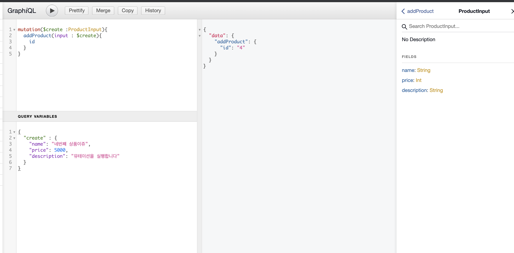
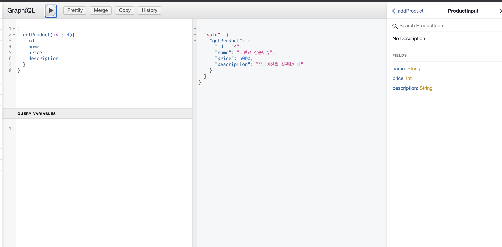

# graphql에 대해 공부합니다.

- RESTful API와는 다릅니다.
- 하나의 엔드포인트에서 모든 요청을 처리합니다.
    - 다만 resolver가 필요합니다. (어떤 쿼리, 뮤테이션인지 서버사이드에서 해석하고, 요청한 필드들에 대한 응답을 제공)

- 스키마를 작성해야 한다.

- Express graphql 타입들..
    - Int : 32bit Integer
    - Float : 부호있는 부동소수점값
    - String : UTF-8 문자열
    - Boolean : true 혹은 false

- 스키마에는 input, type, fragment 등이 있는데유
    - type
        - Mutation (추가/삭제/업데이트등을 위한 기본 필드)
        - Query (조회를 위한 기본 필드)
        - 그 외 사용자 정의 타입
    - input
        - 보통 create mutation 을 하기위한 객체 정의.

```js
const schema = buildSchema(`

    input ProductInput {
        name : String
        price : Int
        description : String
    }

    type Product {
        id : ID!
        name : String
        price : Int
        description : String
    }

    type Query{
        getProduct( id : ID! ) : Product
    }

    type Mutation{
        addProduct( input : ProductInput ) : Product
    }
`);

```

- AWS Appsync 의 경우 schema 파일을 따로 만들어서 너어주구, node.js로 resolve하든가, 자체 resolver가 있죵

- schema.graphql

```graphql
    type Query{
        getProduct( id : ID! ) : Product
    }

    type Mutation{
        addProduct( input : ProductInput ) : Product
    }

    input ProductInput {
        name : String
        price : Int
        description : String
    }

    type Product {
        id : ID!
        name : String
        price : Int
        description : String
    }

```

- 이런식으로 스키마를 정의합니덩.

- mutation과 Query에 있는 저 속성들은 일종의 CRUD 명령들이라고 생각하면 됩니다.

- 사용 예시



